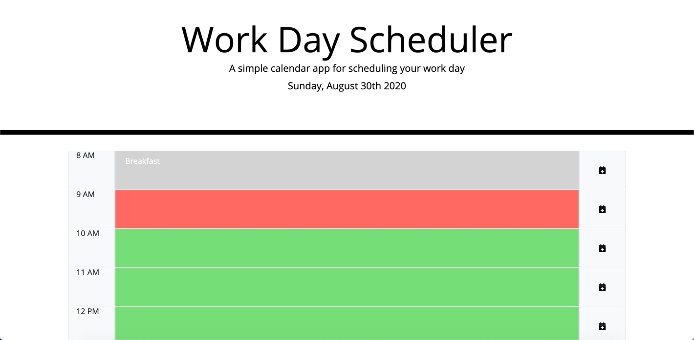

<!-- PROJECT INTRO -->
 

  

  <h3 align="center">Work Day Scheduler</h3>

  

  A simple workday scheduluer to help busy professionals keep track of what they need to do each day.
   
    <a href="https://github.com/heather-everton/Work-Day-Scheduler"><strong>Explore the docs »</strong></a>
     
     
    <a href="https://heather-everton.github.io/Work-Day-Scheduler/">View Demo</a>
    ·
    <a href="https://github.com/heather-everton/Work-Day-Scheduler/issues">Report Bug</a>
    ·
    <a href="https://github.com/heather-everton/Work-Day-Scheduler/issues">Request Feature</a>
  

<!-- TABLE OF CONTENTS -->
## Table of Contents

* [About the Project](#about-the-project)
  * [Built With](#built-with)
* [Getting Started](#getting-started)
* [Roadmap](#roadmap)

<!-- ABOUT THE PROJECT -->
## About The Project

Plan your day and see your productivity skyrocket.

Here's why:
* You don't want to miss any important meetings.
* You can easily plan ahead for everything you need to do each day. 
* You can't afford to spend time playing catch up and missing appointments. 

A list of commonly used resources that I find helpful are listed in the acknowledgements.

### Built With
* [JavaScript](https://javascript.com)
* [html](https://html.com)
* [css](https://free-css.com)
* [jQuery](https://api.jqueryui.com/)
* [boostrap](https://getbootstrap.com/)

<!-- GETTING STARTED -->
## Getting Started

To get started simply click on the desired timeblock and enter your appointment name. Click save to store the changes.

<!-- ROADMAP -->
## Roadmap

See the [open issues](https://github.com/heather-everton/Work-Day-Scheduler/issues) for a list of proposed features (and known issues).
